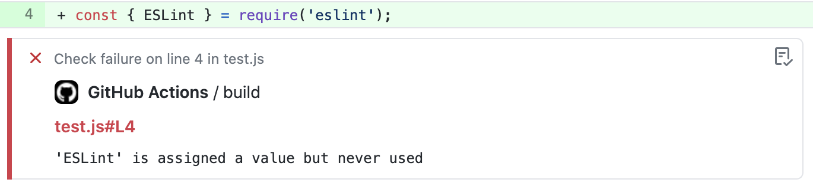

# Action ESLint

> GitHub Action that runs ESLint on files changed in a Pull Request.




## Usage

`.github/workflows/lint.yml`:

```yml
name: Lint

on:
  pull_request:
  push:
    branches:
      - master

jobs:
  eslint:
    runs-on: ubuntu-latest
    steps:
      - uses: actions/checkout@v2
      - uses: actions/setup-node@v2
        with:
          node-version: '14'
      - run: npm ci # or yarn install
      - uses: sibiraj-s/action-eslint@v1
        with:
          eslintArgs: '--ignore-path .gitignore --quiet'
          extensions: 'js, jsx, ts, tsx'
          annotations: true
        env:
          GITHUB_TOKEN: ${{ secrets.GITHUB_TOKEN }}
```

## Security

For better security it is recommended to pin actions to a full length commit SHA.

Read more on [using third-party actions](https://docs.github.com/en/actions/learn-github-actions/security-hardening-for-github-actions#using-third-party-actions)

## Known Issues

- Yarn 2 is not supported

## Debugging

To enable debug logs, set secret `ACTIONS_STEP_DEBUG` to `true`. Refer docs more details https://docs.github.com/en/actions/managing-workflow-runs/enabling-debug-logging#enabling-step-debug-logging
